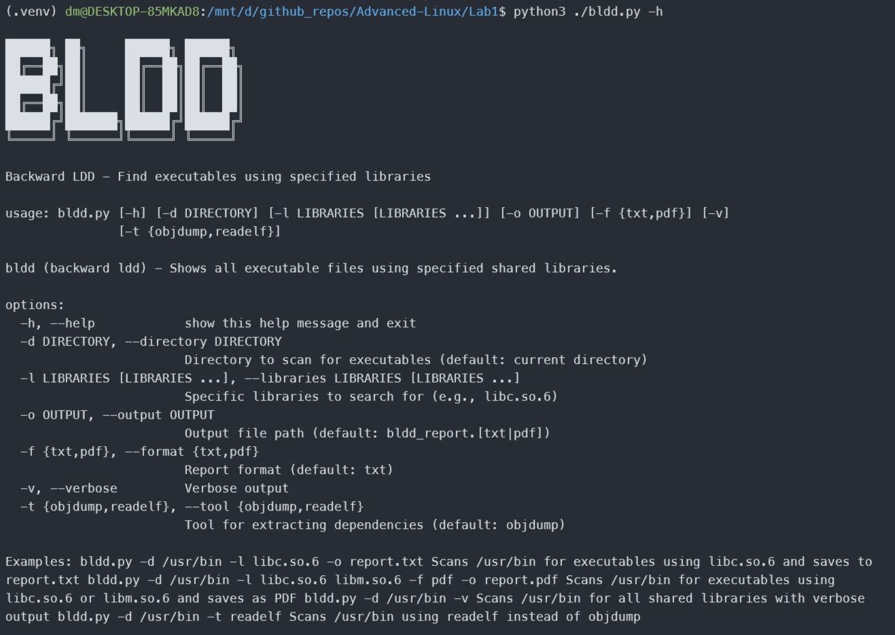
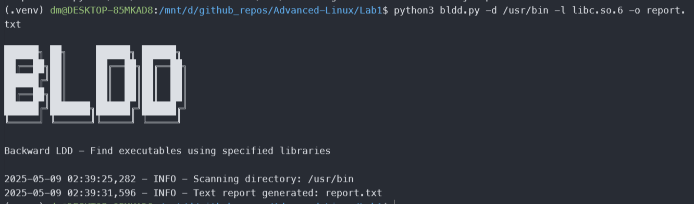
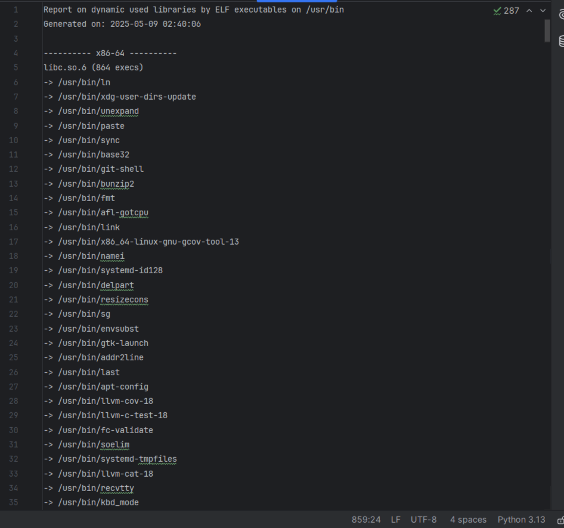
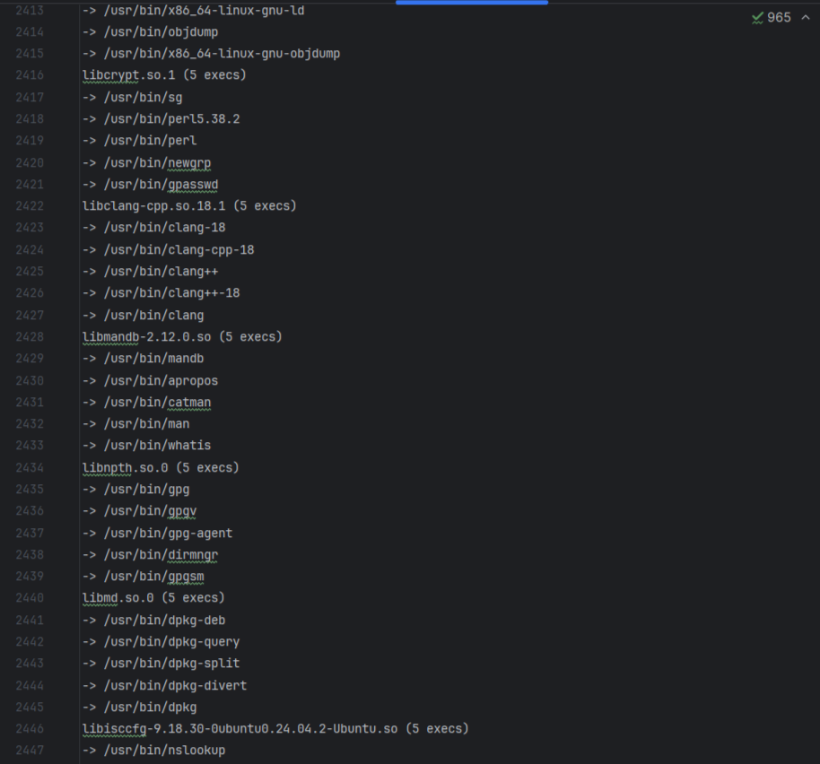
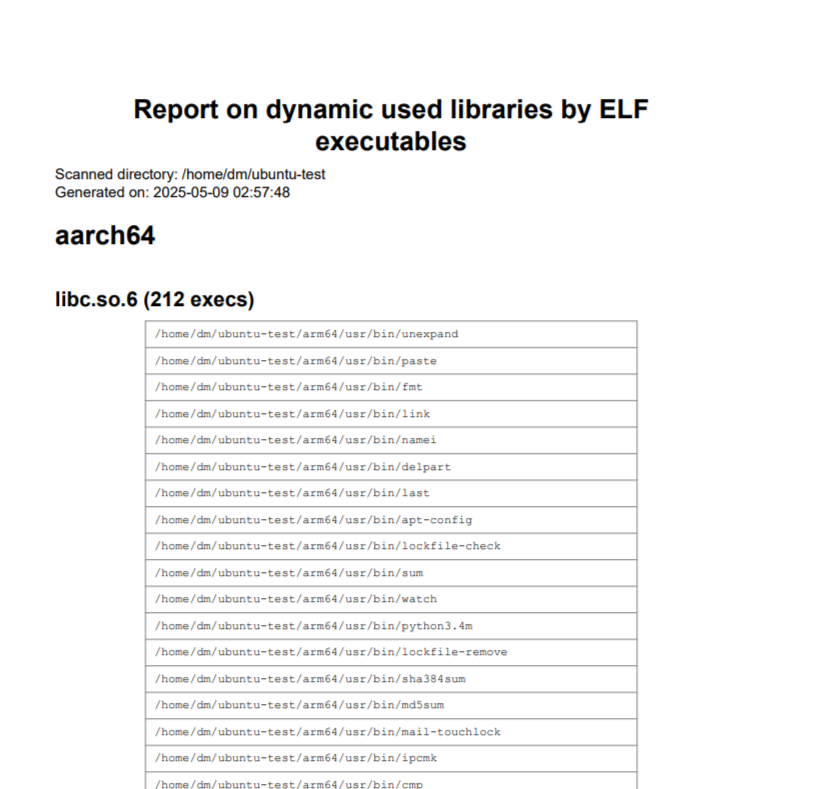
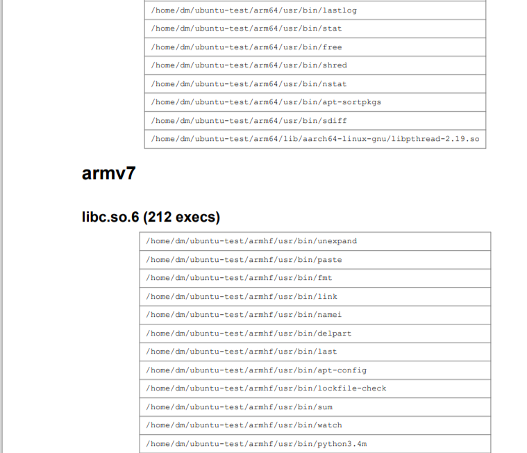
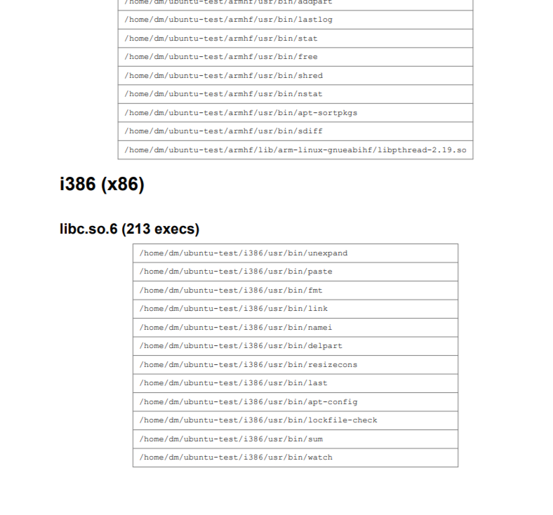

# Advanced-Linux
## Lab 1

Help alias:



```bash
python3 bldd.py -d /usr/bin -l libc.so.6 -o report.txt
```

This command scans the /usr/bin directory to identify all executable files that depend on the libc.so.6 shared library. The utility analyzes each executable's dynamic dependencies, determines their architecture, and generates a comprehensive report saved to report.txt. The output provides a valuable system-wide view of libc.so.6 usage across different CPU architectures.


```bash
python3 bldd.py -d /usr/bin -l libc.so.6 -o report.txt
```



```bash
python3 bldd.py -d /usr/bin -t readelf
```

This command scans all executable files in the /usr/bin directory using the alternative "readelf" tool instead of the default "objdump" for dependency analysis. It examines all shared libraries (not filtering for specific ones) and generates a comprehensive report of all dynamic library dependencies. The report is saved to the default output file "bldd_report.txt". This command is particularly useful for comparing extraction methods or when objdump might have limitations on certain executable formats.



```bash
python3 bldd.py -d ~/ubuntu-test -l libc.so.6 -v -f pdf -o report_all
```


