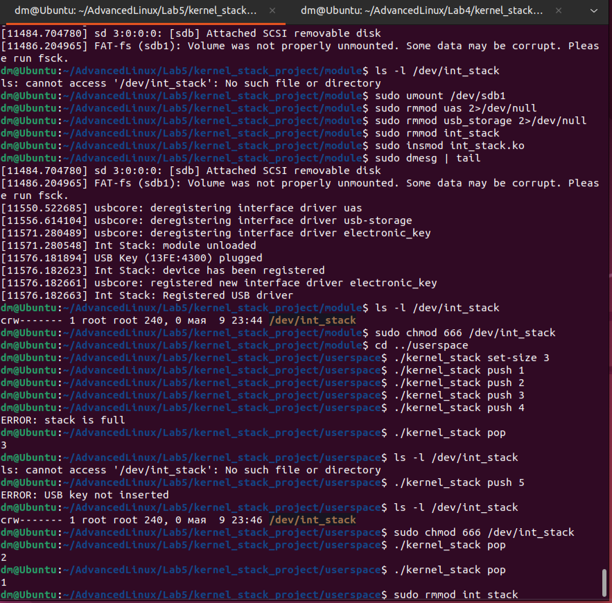

# Advanced Linux
## Lab 5: USB-Protected Kernel Stack Implementation

**Repository**: https://github.com/Friedox/Advanced-Linux/tree/main/Lab5

## Project Overview

Lab 5 extends previous kernel stack implementation from Lab 4 by adding USB device detection capabilities. This enhancement creates a "hardware key" mechanism where the stack operations are only available when a specific USB device is connected to the system.

## Implementation Details

### Identifying the USB Device

First, I identified the USB device using `lsusb` command:

```
dm@Ubuntu:~/AdvancedLinux/Lab5/kernel_stack_project/userspace$ lsusb
Bus 002 Device 003: ID 13fe:4300 Kingston Technology Company Inc. USB DISK 2.0
Bus 002 Device 001: ID 1d6b:0002 Linux Foundation 2.0 root hub
Bus 001 Device 002: ID 80ee:0021 VirtualBox USB Tablet
Bus 001 Device 001: ID 1d6b:0001 Linux Foundation 1.1 root hub
```

The Kingston USB flash drive (ID `13fe:4300`) was selected as the hardware key for this project.

### Kernel Module Modifications

Modified the `int_stack.c` module to implement USB device detection by adding:

```c
static struct usb_device_id electronic_key_table[] = {
    { USB_DEVICE(0x13FE, 0x4300) },
    { }
};
MODULE_DEVICE_TABLE(usb, electronic_key_table);

static struct usb_driver electronic_key_driver = {
    .name = "electronic_key",
    .id_table = electronic_key_table,
    .probe = electronic_key_probe,
    .disconnect = electronic_key_disconnect,
};

static int __init int_stack_init(void)
{
    result = usb_register(&electronic_key_driver);
    return result < 0 ? result : 0;
}
```

### Testing Process

The testing process involved:

1. Load module: Initially, no device node is present
```
dm@Ubuntu:~/AdvancedLinux/Lab5/kernel_stack_project/module$ sudo insmod int_stack.ko
dm@Ubuntu:~/AdvancedLinux/Lab5/kernel_stack_project/module$ ls -l /dev/int_stack
ls: cannot access '/dev/int_stack': No such file or directory
```

2. Connect USB device: Device node appears automatically
```
dm@Ubuntu:~/AdvancedLinux/Lab5/kernel_stack_project/module$ sudo dmesg | tail
[11576.181894] USB Key (13FE:4300) plugged
[11576.182623] Int Stack: device has been registered
[11576.182661] usbcore: registered new interface driver electronic_key
[11576.182663] Int Stack: Registered USB driver
dm@Ubuntu:~/AdvancedLinux/Lab5/kernel_stack_project/module$ ls -l /dev/int_stack
crw------- 1 root root 240, 0 мая  9 23:44 /dev/int_stack
```

3. Set permissions and use stack operations
```
dm@Ubuntu:~/AdvancedLinux/Lab5/kernel_stack_project/module$ sudo chmod 666 /dev/int_stack
dm@Ubuntu:~/AdvancedLinux/Lab5/kernel_stack_project/userspace$ ./kernel_stack set-size 3
dm@Ubuntu:~/AdvancedLinux/Lab5/kernel_stack_project/userspace$ ./kernel_stack push 1
dm@Ubuntu:~/AdvancedLinux/Lab5/kernel_stack_project/userspace$ ./kernel_stack push 2
dm@Ubuntu:~/AdvancedLinux/Lab5/kernel_stack_project/userspace$ ./kernel_stack push 3
dm@Ubuntu:~/AdvancedLinux/Lab5/kernel_stack_project/userspace$ ./kernel_stack push 4
ERROR: stack is full
```

4. Disconnect USB: Device node disappears
```
dm@Ubuntu:~/AdvancedLinux/Lab5/kernel_stack_project/userspace$ ls -l /dev/int_stack
ls: cannot access '/dev/int_stack': No such file or directory
dm@Ubuntu:~/AdvancedLinux/Lab5/kernel_stack_project/userspace$ ./kernel_stack push 5 
ERROR: USB key not inserted
```

5. Reconnect USB: Device node reappears and stack data is preserved
```
dm@Ubuntu:~/AdvancedLinux/Lab5/kernel_stack_project/userspace$ ls -l /dev/int_stack
crw------- 1 root root 240, 0 мая  9 23:46 /dev/int_stack
dm@Ubuntu:~/AdvancedLinux/Lab5/kernel_stack_project/userspace$ sudo chmod 666 /dev/int_stack
dm@Ubuntu:~/AdvancedLinux/Lab5/kernel_stack_project/userspace$ ./kernel_stack pop
2
dm@Ubuntu:~/AdvancedLinux/Lab5/kernel_stack_project/userspace$ ./kernel_stack pop
1
```

Screenshot:



## Challenges and Solutions

### Conflict with Default Kernel USB Storage Driver

The primary challenge was handling conflicts with the default kernel USB storage drivers (`usb-storage` and `uas`). When connecting the USB flash drive, these drivers would automatically claim the device before our custom driver could handle it.

Solution:
1. Unload the conflicting drivers before testing:
```
dm@Ubuntu:~/AdvancedLinux/Lab5/kernel_stack_project/module$ sudo umount /dev/sdb1
dm@Ubuntu:~/AdvancedLinux/Lab5/kernel_stack_project/module$ sudo rmmod uas 2>/dev/null
dm@Ubuntu:~/AdvancedLinux/Lab5/kernel_stack_project/module$ sudo rmmod usb_storage 2>/dev/null
```

This allowed our custom USB driver to claim the device without interference from the standard storage drivers.

## Conclusion

In Lab 5, I integrated USB detection with kernel module:

- Modified kernel module to register USB driver
- Added functions to detect USB insertion/removal
- Created/removed device node based on USB presence
- Solved conflict with standard usb-storage driver
- Preserved stack data between USB reconnections
